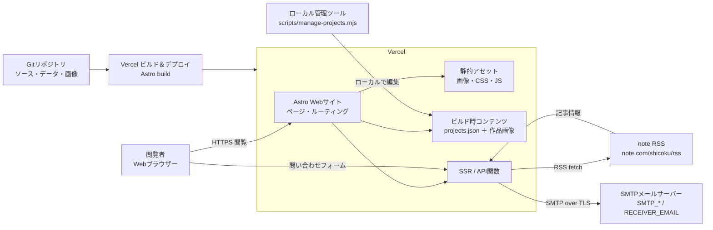

# システム構成図

```mermaid
flowchart LR
    user[閲覧者<br/>Webブラウザー]

    subgraph vercel[ Vercel ]
        site[Astro Webサイト<br/>ページ・ルーティング]
        assets[静的アセット<br/>画像・CSS・JS]
        data[ビルド時コンテンツ<br/>projects.json ＋ 作品画像]
        functions[SSR / API関数]
    end

    note[note RSS<br/>note.com/shicoku/rss]
    smtp[SMTPメールサーバー<br/>SMTP_* / RECEIVER_EMAIL]
    repo[Gitリポジトリ<br/>ソース・データ・画像]
    deploy[Vercel ビルド＆デプロイ<br/>Astro build]
    editor[ローカル管理ツール<br/>scripts/manage-projects.mjs]

    user -->|HTTPS 閲覧| site
    site --> assets
    site --> data
    site --> functions
    functions -->|RSS fetch| note
    note -->|記事情報| functions
    user -->|問い合わせフォーム| functions
    functions -->|SMTP over TLS| smtp
    repo --> deploy
    deploy --> vercel
    editor -->|ローカルで編集| data
```
